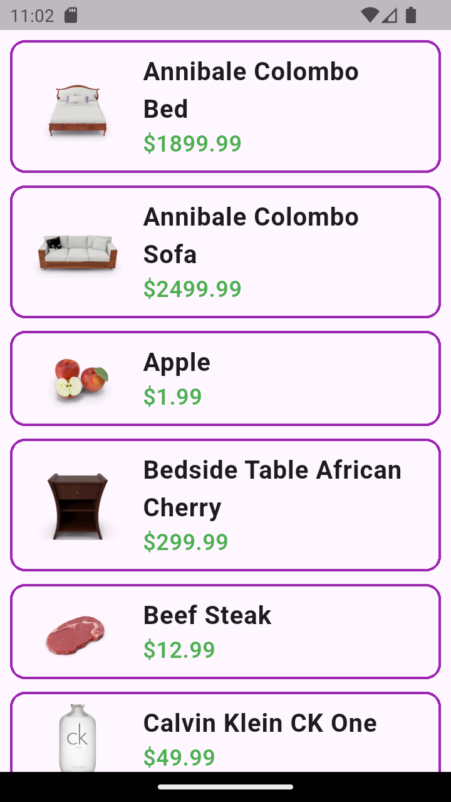
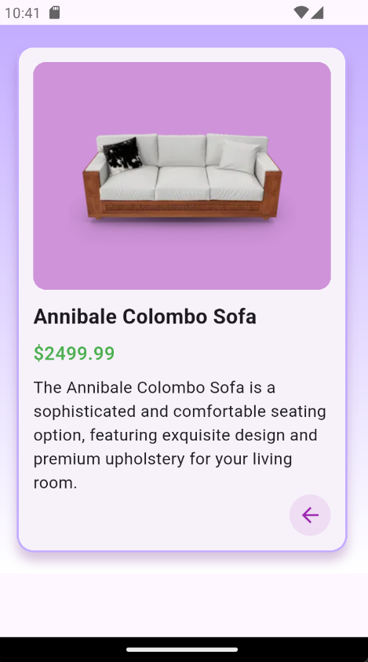

# product_app

A new Flutter project.

## Screenshot

  
  

## การจัดการ State Error
ครอบการเรียก API ด้วย  try-catch เพื่อจัดการ API error หรือ statusCode != 200 ในกรณีที่ error โยน Exception จาก ProductService และแสดงผลให้ผู้ใช้งานผ่าน AlertDialog

## การจัดการ Loading
ใช้ Future delayed เพื่อแสดง CircularProgressIndicator เป็นเวลา 5 วินาที แล้วใช้ Navigator.pushReplacement ไปที่หน้า Screen 

## การจัดการ stucture
ใช้รูปแบบ structure แบบ MVC ในการจัดระเบียบโฟลเดอร์ มีการสร้างโมเดลที่รองรับข้อมูลที่ต้องการจาก API แทนการเรียกใช้ข้อมูลจาก API โดยตรง

